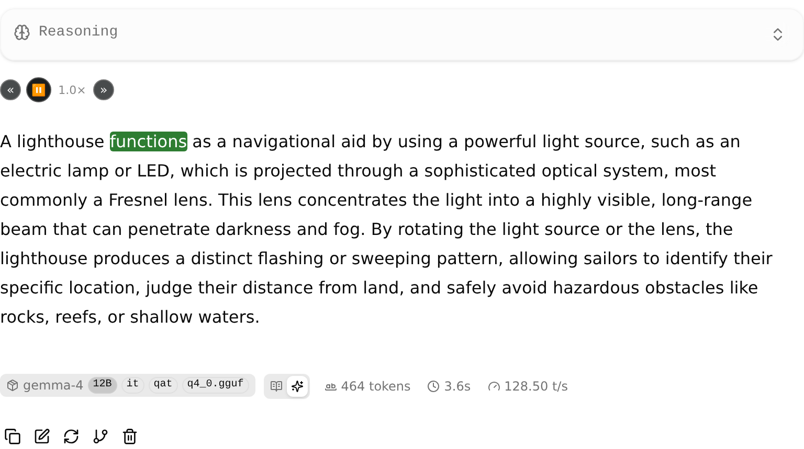
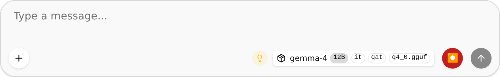
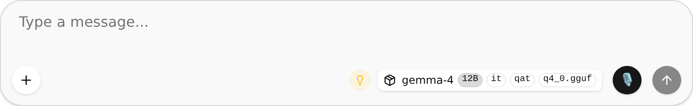
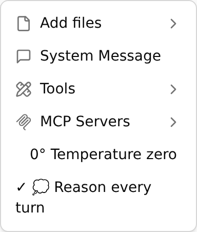

# Gemma 4 12B llamafile — inference *and* embeddings from one server instance

This repo bridges [mozilla-ai/llamafile](https://github.com/mozilla-ai/llamafile)
(v0.10.7 on this branch, built from source with the Cosmopolitan toolchain) with
[google/gemma-4-12B-it-qat-q4_0-gguf](https://huggingface.co/google/gemma-4-12B-it-qat-q4_0-gguf)
and serves **chat completions and embeddings from a single model instance** —
one set of weights in memory, one KV cache, one port:

| Endpoint | What it does |
|---|---|
| `POST /v1/chat/completions` | OpenAI-style chat (Gemma 4 chat template, thinking channel in `reasoning_content`) — accepts text, **images** (`image_url` data URIs) and **audio** (`input_audio`, wav/mp3) |
| `POST /v1/embeddings` | OpenAI-style embeddings (3840-dim, mean-pooled, L2-normalized) |
| `GET /health`, `POST /tokenize`, … | usual llama-server extras |

## What's new in v0.2.0 — GPU + voice ([full changelog](CHANGELOG.md))

**NVIDIA GPU inference in the packaged file.** The APE now bakes in a
TinyBLAS CUDA backend (driver-only at runtime) with the upstream fattn fixes
Gemma 4's 512-dim heads need (patches 0016/0017) and CUDA graphs enabled.
Measured on an RTX 3080 Ti: 9 → ~200 tok/s raw, ~90–110 tok/s chat. Details
and the cross-platform compatibility matrix: [docs/PLATFORM-NOTES.md](docs/PLATFORM-NOTES.md).

**Voice, in both directions.** A CPU-only [Kokoro-82M](https://huggingface.co/hexgrad/Kokoro-82M)
sidecar (`voice/`) gives the web UI karaoke-style read-aloud — every word
highlights as it's spoken, click any word to jump there, «/» speed controls,
~0.13 s start via prefetch — and a 🎙 button records WAV audio questions for
Gemma's audio input.

| | |
|---|---|
|  |  |
| Karaoke read-aloud: controls under the reasoning dropdown, spoken word highlighted, reading-speed « » | 🎙 next to Send — red while recording, attaches a WAV to the message |
|  |  |
| The composer | “0° Temperature zero” and “💭 Reason every turn” live in the + menu |

## How the dual mode works

llama-server's `--embeddings` flag is documented as *"restrict to only support
embedding use case"*, and `/v1/embeddings` refuses to run without it. But the
scheduler calls `llama_set_embeddings(ctx, slot->need_embd())` per batch
(`llama.cpp/tools/server/server-context.cpp`), flipping the context between
logit and embedding output on the fly. So one instance started with
`--embeddings --pooling mean` serves both task types concurrently — generation
slots and embedding slots interleave in the same scheduler.

## Quickstart

```sh
make setup     # init submodules, apply patches, install cosmocc toolchain
make build     # build bin/llamafile + bin/zipalign from source (APE binaries)
make model     # download the GGUF weights (~7.1 GB, public repo)
make serve     # start the dual-mode server on 127.0.0.1:8080
make test      # smoke-test both APIs (run against the running server)
```

Or bake everything into one self-contained executable (runs on macOS/Linux/BSD,
arm64 + x86_64, no install — weights, args and server in a single file):

```sh
make package
./dist/gemma4-server.llamafile            # same dual-mode server
./dist/gemma4-server.llamafile --port 9000   # CLI args override baked-in ones
```

### Talking to it

```sh
curl http://127.0.0.1:8080/v1/chat/completions -H 'Content-Type: application/json' \
  -d '{"messages":[{"role":"user","content":"Why is the sky blue?"}],"max_tokens":512}'

curl http://127.0.0.1:8080/v1/embeddings -H 'Content-Type: application/json' \
  -d '{"input":["the sky is blue","der Himmel ist blau"]}'
```

Or with the zero-dependency Python client:

```python
from client.gemma4_client import Gemma4Client, cosine
c = Gemma4Client()
c.chat([{"role": "user", "content": "Why is the sky blue?"}])
v = c.embed(["the sky is blue", "der Himmel ist blau"])
cosine(v[0], v[1])
```

### Tunables (env vars for `make serve` / `scripts/serve.sh`)

| Var | Default | Meaning |
|---|---|---|
| `GEMMA4_HOST` / `GEMMA4_PORT` | `127.0.0.1` / `8080` | bind address |
| `GEMMA4_CTX` | `8192` | total context (model supports up to 262144) |
| `GEMMA4_SLOTS` | `2` | parallel slots; lets embeddings run beside an in-flight generation |
| `GEMMA4_UBATCH` | `2048` | physical batch; pooled embedding inputs can't split, so this caps embedding input length |
| `GEMMA4_POOLING` | `mean` | `mean`, `last`, `cls`, `none` |
| `GEMMA4_NGL` | `999` | GPU layers (Metal on macOS; see caveats) |
| `GEMMA4_MM` | `1` | image + audio input via the mmproj; `0` for text-only |
| `GEMMA4_SPEC` | `draft-mtp`* | speculative decoding type (`none`, `ngram-simple`, `ngram-cache`, `draft-mtp`); *defaults to `draft-mtp` when `models/mtp-*.gguf` exists, else `ngram-simple` |
| `GEMMA4_SPEC_NMAX` | `2` | draft-mtp draft length (2 is the measured optimum on M4 Metal; 4 wins on CUDA) |
| `GEMMA4_CKPT` | `0` | context checkpoints per slot; `0` avoids a hidden second full forward pass on every prefill (−130 ms/request on M4). Set `32` (upstream default) for cheap mid-history rollback in chat UIs with frequent edits |
| `GEMMA4_DRAFT` | unset | path to a draft GGUF (e.g. gemma-4-E2B) for classic draft-model speculation |

## System requirements & default-launch performance

What you get when you run `./gemma4-server.llamafile` (or `make serve`) with no
flags: dual-mode server on `127.0.0.1:8080`, context 8192, all layers on GPU
where available (Metal on Apple silicon), MTP speculative decoding with draft
length 2, prefill checkpoints off.

### Measured speed (Apple M4 Mac mini, 16 GB, macOS, Metal — the default config)

| workload | tok/s | vs no-spec baseline |
|---|---|---|
| freeform prose (greedy, 360 tok) | **21.2–21.6** | 1.6× |
| edit/copy task (greedy, 400 tok) | **24.9–25.1** | 1.9× |
| no-spec baseline (`--spec-type none`) | 13.1 | – |

Prefill/TTFT: ~250 ms flat for prompts of 8–25 tokens, ~11 ms/token beyond
that (the artifact disables the upstream checkpoint prefill split, worth up to
−43% time-to-first-token vs stock; restore with `--ctx-checkpoints 32`).
CPU-only mode (`-ngl 0`, any x86_64/arm64 box) is roughly 4–5× slower than
Metal on the same machine; MTP still gives ~+14% there.

### Measured speed (Apple M1 Pro, 32 GB — E2E verified 2026-07-06)

21.5–22.2 tok/s on prose regardless of MTP: the M1 Pro's faster base decode
(higher memory bandwidth than plain M4) meets the same batch-2 verify cost,
so speculation is **break-even** here rather than 1.6× (acceptance 0.91,
but b=2 decode ≈ 1.75× a single step — see the Metal finding below).
Full feature matrix (chat, embeddings, concurrency, KV persistence,
image input, MTP) verified via `./scripts/mac-full-test.sh --start-server`;
Mac-specific footguns are logged in `docs/PLATFORM-NOTES.md`.

### Memory by context size (measured, default config with MTP drafter + mmproj)

| `-c` (context) | KV + compute (private) | + weights (mmap) | practical total |
|---|---|---|---|
| 2048 | ~1.3 GB | 7.1 GB | ~8.4 GB |
| 8192 (default) | ~2.0 GB | 7.1 GB | ~9.1 GB |
| 32768 | ~2.4 GB | 7.1 GB | ~9.5 GB |

KV growth is sublinear because most of Gemma 4's 48 layers use sliding-window
attention (only the global-attention layers scale with context). The weights
are mmap'd: pages load on demand and the OS can evict them under pressure, so
"practical total" is steady-state resident size, not a hard allocation.

**Requirements:** 16 GB unified memory recommended on Apple silicon (macOS
caps the GPU working set at ~12.1 GB on a 16 GB machine — the default config
fits with room for the OS). 12 GB machines should drop to `-c 4096` and expect
paging under load. Disk: 7.2 GB for the packaged artifact (or 7.1 GB of
models + a 35 MB binary when built from source). >4 GB executables can't run
on Windows — use `bin/llamafile` with external weights there.

**NVIDIA/CUDA (validated on 2× RTX 4090, CUDA 12.8):** the packaged file now
bundles a CUDA backend DSO (TinyBLAS — needs only the NVIDIA driver, not the
toolkit; real SASS for sm_80/86/89, PTX for sm_75/90), extracted to
`~/.llamafile` on first run. MTP speculative decoding works on CUDA with
flash attention enabled — the upstream crash cluster (ggml-org/llama.cpp
#24376, #24314, #24457: `fattn.cu` aborts during MTP draft-context init)
did not reproduce on sm_89. If you hit it on other architectures (reported
on sm_87/Jetson and HIP), `--flash-attn off` is the known-good workaround
and MTP keeps most of its gain. Measured, greedy, 400 fresh tokens:

| config | prose tok/s | edit/copy tok/s |
|---|---|---|
| `--spec-type none` | 95 | 93 |
| baked defaults (MTP n=2, `-sm layer` across 2 GPUs) | 115 | 142 |
| `-sm none` (single GPU; the 7 GB model fits easily) | 155 | 189 |
| `-sm none --spec-draft-n-max 4` ← recommended | 165 | 239 |

Two CUDA-specific notes: the dual-GPU layer split costs ~25% single-stream
(pipeline hop per token) — prefer `-sm none` whenever the model fits on one
card; and CUDA's batched verify is cheap enough that draft length 4 beats
the Metal-tuned default of 2 (which on a 4090 is roughly speed-neutral on
prose at 1.65× the no-spec baseline either way — n=4 adds another ~25% on
edit/RAG-style output).

To rebuild the bundled DSO: `vendor/llamafile/llamafile/cuda.sh
--minimize-size --output models/ggml-cuda.so` (CUDA toolkit ≥ 12.0 needed at
build time only; `package.sh` bakes `models/ggml-cuda.so` in when present).

## Layout

```
vendor/llamafile/      SEBK4C/llamafile fork @ v0.10.7 (submodule; nests llama.cpp)
patches/               our llama.cpp fixes, applied by `make setup` (see below)
scripts/               fetch-model / serve / package / apply-patches
package/gemma4.args    args baked into the single-file build
client/                zero-dependency Python client
tests/smoke_test.py    health + chat + embeddings + concurrent mixed load
models/, bin/, dist/   gitignored artifacts (weights, binaries, packaged file)
```

## The pooled-embedding bug we found (and patch)

`patches/0001-pooled-embeddings-one-seq-per-ubatch.patch` fixes a real
correctness bug in upstream llama.cpp (at pin `dbe9c0c`), found while testing
this setup:

When one request embeds **multiple texts of unequal length**, the iSWA
(sliding-window) KV cache that Gemma 4 uses splits the batch with
`split_equal()`, which can spread a sequence across several ubatches. Pooling
runs per ubatch and the last result wins, so the returned "mean" embedding of
the longest text covered **only its trailing tokens**. We reproduced it
exactly: embedding a 10-token and a 13-token text together returned, for the
longer one, `mean(tokens[10:13])` instead of `mean(tokens[0:13])` —
batch composition silently changed embedding values.

The patch makes both attention caches honor the `embd_all` flag (like the
recurrent/hybrid caches already do) by using `split_seq()`, which keeps each
sequence whole within a ubatch. `tests/smoke_test.py` carries a regression
check (batched vectors must equal solo vectors).

The patch is maintained here rather than upstreamed because llama.cpp does not
accept predominantly AI-generated contributions; if you want to report it
upstream, the analysis above plus the patch file is everything you need.

## Speculative decoding (and the MTP investigation)

The server runs with **`--spec-type ngram-simple`** by default: model-free
self-speculation that drafts continuations from n-gram matches over the
prompt and prior output, verified by the target model. Measured on the M4
(temperature 0, ngram-simple): freeform prose is unaffected (13.3 vs 13.4
tok/s), while outputs that echo parts of the prompt — edits, RAG answers
with quotes, code modification — run **~15-16%** faster (15.4 vs 13.3 tok/s).
`ngram-cache` accepts more drafts (+19% on edits) but costs ~8% on prose, so
it's opt-in: `GEMMA4_SPEC=ngram-cache make serve`, or `GEMMA4_SPEC=none` to
disable. Embeddings are unaffected (the smoke test verifies this).

**True MTP (this branch).** Google ships an official drafter for this model
([gemma-4-12B-it-assistant](https://huggingface.co/google/gemma-4-12B-it-assistant),
423M params), whose 4 drafter layers cross-attend directly into the
*backbone's* KV cache — something llama.cpp's per-context memory model
couldn't express until upstream PR #23398 added the `GEMMA4_ASSISTANT`
arch with cross-context KV aliasing. This branch integrates that work
(llama.cpp pin `04eb4c446d`, drafter converted to
`models/mtp-gemma-4-12b-it-qat-q4_0.gguf`, 449 MB q8_0) and — after the
Metal fixes below — makes `draft-mtp` the default in the **packaged**
artifact (`--spec-draft-n-max 2 --fit off`): **20 tok/s single-slot on
the M4, 1.5× baseline**, +14% on CPU, outputs verified byte-identical to
non-speculative decoding. `scripts/serve.sh` keeps ngram-simple as its
default; opt in with `GEMMA4_SPEC=draft-mtp`.

### MTP on CUDA (validated 2026-06-11, 2× RTX 4090)

MTP pays off much more on CUDA than the Metal numbers suggest — the no-spec
baseline on a 4090 is 93–97 tok/s and `draft-mtp` lifts it to 155–165 tok/s
on prose (1.65×) and up to 239 tok/s on edit/copy tasks (2.5×) with
`-sm none --spec-draft-n-max 4` (see the NVIDIA/CUDA requirements section
for the full table). Acceptance on greedy prose is ~40–55% depending on
draft length. The upstream CUDA+MTP flash-attn crash cluster did not
reproduce on sm_89 with `-fa auto` (resolves to on). One measurement trap
worth knowing: before patch 0012, `--spec-type none` on the packaged file
did NOT disable the baked-in drafter (types append), so naive A/B runs
compare MTP against itself — if your "baseline" prints `draft_n` in
timings, it's not a baseline.

Three fixes came out of the CUDA validation, all server/CLI-side:

- `patches/0012-spec-type-none-resets-list.patch` — `--spec-type` appends
  values (by design, so types can combine), which made it impossible to
  disable the baked-in `draft-mtp` from the CLI. `none` now resets the
  accumulated list: `--spec-type none` disables speculation, and
  `--spec-type none --spec-type ngram-simple` replaces the default instead
  of adding to it.
- `patches/0013-skip-draft-model-load-when-spec-disabled.patch` —
  `has_dft()` ignored the enabled types, so the baked-in `-md` loaded the
  drafter even with speculation off (wasted VRAM with a normal draft gguf;
  startup abort with the head-only MTP gguf).
- `patches/0014-draft-context-no-embeddings.patch` — the draft/MTP context
  inherited `--embeddings --pooling mean` from the server config and
  asserted in `build_pooling` ("missing result_norm/result_embd tensor"):
  the MTP assistant graph has no result_norm. Embeddings always come from
  the target context, so the draft context now clears both flags.

### The Metal finding: ggml's small-batch matmul kernels underperform on M4

Draft-mtp initially ran *31% slower than baseline* on Metal. The cause
turned out to be nothing MTP-specific: **ggml-metal's `mul_mv_ext`
"small-batch" kernels (dispatched for q4_0 at batch widths 2–8) are
~1.7× slower than the plain mat-vec kernels on the M4**, and batched
decode costs grow near-linearly with width (~47 ms per extra token vs
75 ms for an entire single-token decode) — speculative *verification*
batches live exactly in that window, so every spec round cost almost as
much as decoding its tokens one by one. Uncached-prefill probe
(`tests/probe_batch_cost.py`, total ms per batch, gemma4-12b q4_0):

| batch width | ext kernels (upstream default) | plain mv (our fix) | mat-mat kernel |
|---|---|---|---|
| 2 | 118 | **77** | 227 |
| 4 | 200 | **119** | 233 |
| 8 | 387 | **229** | 453 |
| 10 | 470 | **283** | 454 |
| 13 | 420 | 367 | 422 |

Crucially, this is **not a llamafile build artifact**: stock upstream
llama.cpp compiled at the same pin on the same machine probes
identically (108/194/381/468 ms at widths 2/4/8/10), and brew's
prebuilt — which ships an offline-compiled metallib — benches the same,
so neither llamafile's runtime shader compile nor a newer upstream
version explains it (the kernels and dispatch are unchanged on master).
Upstream's ext kernels were benchmarked as wins on M1–M3 in 2024; on M4
they lose everywhere in their window. Nobody appears to have documented
this. Worth reporting upstream — by a human; llama.cpp does not accept
AI-authored issues or PRs.

What we ship in the fork ([SEBK4C/llamafile](https://github.com/SEBK4C/llamafile),
branch `mtp-gemma4-drafter`, v0.10.5): ext kernels disabled by default
(`GGML_METAL_MV_EXT=1` re-enables), the mat-vec/mat-mat crossover raised
from 8 to 12, and GGML error-level messages from the Metal dylib
forwarded to stderr even in non-verbose mode (a silent
`kIOGPUCommandBufferCallbackErrorOutOfMemory` cost us hours). Still on
the table: the mat-vec path's ~28 ms/extra-token slope and the mat-mat
kernel's ~360-420 ms base cost are both far from the ~80-100 ms a
memory-bound batched step should cost — fixing that is worth roughly
another +30% on speculative decoding and ~4× on prefill, and needs real
kernel work with GPU profiling (full Xcode). Mission brief:
`docs/metal-batch-kickoff.md`.

**Classic draft-model speculation** (for machines with >24 GB unified/GPU
memory): `gemma-4-E2B-it-qat-q4_0-gguf` (arch `gemma4`, same 262k vocab,
4.6 GB) works as a conventional drafter:

```sh
./scripts/fetch-model.sh --draft
GEMMA4_DRAFT=models/gemma-4-E2B_q4_0-it.gguf make serve
```

Not packaged into the single-file build: it would grow the file to ~11 GB,
and on 16 GB machines both models can't share the Metal budget (the drafter
would fall to CPU and draft slower than the target generates).

## Image and audio input

Multimodal input is on by default (`GEMMA4_MM=0` disables). Gemma 4's
multimodality is *encoder-free*: the 175 MB
`mmproj-gemma-4-12b-it-qat-q4_0.gguf` contains no vision/audio towers
(`block_count = 0`), just projections — images become raw 224px/16px
patches and audio becomes raw 16 kHz waveform chopped into 640-sample
(40 ms) frames, all understood by the 12B backbone itself. Preprocessing
(image decode/resize, WAV/MP3 decode, frame chunking) happens inside the
server via the mtmd API, so clients just send standard OpenAI content parts:

```jsonc
// image
{"type": "image_url", "image_url": {"url": "data:image/png;base64,...."}}
// audio (wav or mp3)
{"type": "input_audio", "input_audio": {"data": "<base64>", "format": "wav"}}
```

Verified on this machine: coarse visual grounding (color/position) and
word-perfect transcription of spoken audio (`say`-generated, 16 kHz mono
WAV). ~19-28 s per image/audio turn on the M4 (the projector runs on CPU —
`--no-mmproj-offload` — because this ggml vintage's Metal conv kernels
assert on the projector's op shapes; the 12B stays on Metal).

> **Update (2026-06-11, later the same day)**: root-caused and largely
> fixed — the runtime kept small images below the soft-token budget the
> model was trained on (patch 0010 restores reference budget-fill resize,
> bicubic, F32 accumulation). For OCR-ish work also serve with
> `--image-max-tokens 1120` (Google's recommended budget; default 280).
> Residual weakness is architectural: the 12B *Unified* vision path is
> encoder-free, so fine text tops out around ~60–65% word recall — use a
> ViT-path model for OCR that must work. Full story in
> docs/mm-embedding.md and docs/session-2026-06-11-summary.md.

Support required backporting upstream commit `a731805ced` (the `gemma4uv`
/ `gemma4ua` unified projector types postdate our llama.cpp pin) — carried
as `patches/0005` + `0006`. Two more patches (`0007`, `0008`) make KV
persistence coexist with multimodal: slot save is now refused only for
slots whose state actually *contains* media (which can't be serialized),
instead of whenever multimodal is merely enabled.

### Cross-modal embeddings (and the modality gap)

`/v1/embeddings` also accepts media, using the server's tokenizer object
format (fetch the per-process marker from `/props`):

```json
{"input": {"prompt_string": "<__media_...__>", "multimodal_data": ["<base64 png/wav/mp3>"]}}
```

Full writeup with tables, practical guidance and dev notes (candidate HF
datasets for a learned alignment): [docs/mm-embedding.md](docs/mm-embedding.md).

`tests/modality_gap.py` embeds the same sentences as text, rendered onto
images, and spoken aloud (macOS `say`). What we measured (3 topics): the
embedding space is dominated by **modality, not content** — same-modality
pairs score 0.55–0.94 while cross-modal pairs of the *same sentence* sit at
0.3–0.6, and raw cross-modal retrieval is barely above chance. The
modality drift is a large (|d| ≈ 1.0–1.15 on unit vectors), *partially*
consistent offset: image-drift directions agree at cos 0.69–0.81 across
topics, audio-drift only 0.46–0.53, and image vs audio drifts point in
different directions (cos 0.48). Subtracting the mean offset (the classic
modality-gap correction) helps only marginally (2/6 → 3/6 retrieval) —
unlike contrastively-trained encoders, this generative model's modality
gap is not a clean parallel translation, so cross-modal retrieval needs a
trained alignment, not a geometric fix. Caveat: image understanding of
rendered text is unreliable regardless of font size — the image pipeline
distorts patch geometry (the model perceives square inputs as wide/cropped
strips; see "Image pipeline distortion" in docs/mm-embedding.md). Verify
with an OCR prompt before trusting image embeddings of documents.

**GPU caveat**: media inputs on the *embeddings* endpoint crash the GPU
backend (chat with media is fine; text embeddings are fine). The server
now refuses such requests with HTTP 501 instead of crashing (patch 0009).
Run `GEMMA4_NGL=0 make serve` to embed images/audio on the CPU backend;
root-cause notes live in docs/mm-embedding.md.

## KV cache persistence (automatic — survives restarts)

The server's in-RAM prompt cache dies with the process. We additionally
enable **on-disk KV state**: `scripts/serve.sh` runs with
`--slot-save-path .kvcache/` (repo root), and the packaged llamafile uses a
hidden `.gemma4-kv/` directory created next to wherever you launch it.

**Since 0.10.7 this is automatic** (patch `0011`): on graceful shutdown
(SIGINT/SIGTERM, not SIGKILL) every text-only slot with cached tokens is
written to `autosave-slot-<id>.bin`, and on the next launch those files are
restored before the server starts answering — a prompt matching the cached
prefix skips straight to generation, no API calls involved.
`--no-slot-autosave` opts out. If the launch directory is read-only the
server no longer refuses to start: it warns and falls back to
`~/.cache/llamafile/kv/`, disabling persistence only if that also fails.
Two limitations: a slot whose prompt was already migrated to the in-RAM
cache (happens when a *new* request arrives while it sits idle) has nothing
left to autosave, and the MTP drafter state is not restored, so the first
verify rounds after a restart draft at reduced acceptance (speed-only,
self-heals).

Manual save/restore still works for named checkpoints — a slot's
processed-prompt state (tokens + KV cache) can be saved, then restored
after a full server restart:

```sh
# after sending a request whose long prefix you want to keep (slot 0 or 1):
curl -X POST 'http://127.0.0.1:8080/slots/1?action=save' \
  -H 'Content-Type: application/json' -d '{"filename":"my-system-prompt.bin"}'

# ... restart the server, then:
curl -X POST 'http://127.0.0.1:8080/slots/1?action=restore' \
  -H 'Content-Type: application/json' -d '{"filename":"my-system-prompt.bin"}'
```

The Python client wraps these as `save_slot` / `restore_slot` / `erase_slot`.
Measured effect: an 870-token system prompt that took 6.2 s to process cold
is reused from the restored state with `prompt_n=1` in 0.14 s (~45× faster
time-to-first-token; the state file was 325 MB, restore took 91 ms).
State files scale with cached tokens (~0.3 MB/token at ctx 8192 defaults).

Making this work surfaced three more upstream/overlay bugs, fixed in
`patches/` (applied by `make setup`):

- `lf-0001`: the 0.10.x overlay routes every `llama_file` open through
  `llamafile_open_gguf`, which magic-checked all files — `"wb"` saves
  failed after creating an empty file, and restores of non-GGUF state
  files fell into the `.zip` branch and failed.
- `0003`: the COSMOCC `llama_file::write_raw` wrote through an
  uninitialized `FILE*` instead of the overlay's file handle.
- `0004`: for sliding-window models the server refused checkpoint-less
  partial reuse even when `seq_pos_min == 0` proves nothing was evicted —
  so restored states were always fully re-processed. (Checkpoints aren't
  serialized into state files, so this gate made restore useless for SWA
  models like Gemma 4.) Verified token-for-token identical greedy output
  with and without reuse, plus a regression check in the smoke test.
- `0002`: `--slot-save-path` now auto-creates the directory, so it can be
  baked into the packaged llamafile's defaults.

## Publishing the packaged llamafile

`dist/gemma4-server.llamafile` (6.5 GB) is too big for GitHub (100 MB file
cap; LFS free tier 2 GB), so this repo ships code only — weights and packaged
binaries are gitignored. Hugging Face model repos are the natural home for
the artifact (it's where mozilla-ai publishes their prebuilt llamafiles):

```sh
pip install -U huggingface_hub
hf auth login
hf repo create gemma-4-12b-it-qat-q4_0-llamafile --type model
hf upload <your-username>/gemma-4-12b-it-qat-q4_0-llamafile \
    dist/gemma4-server.llamafile gemma4-server.llamafile
```

Downstream users then need exactly two commands:

```sh
curl -LO https://huggingface.co/<your-username>/gemma-4-12b-it-qat-q4_0-llamafile/resolve/main/gemma4-server.llamafile
chmod +x gemma4-server.llamafile && ./gemma4-server.llamafile
```

If you publish, note the model weights are Apache 2.0 with Google's
[Gemma 4 license link](https://ai.google.dev/gemma/docs/gemma_4_license) on
the card — mirror that in your model card.

## Voice interface (ALPHA)

> **Status: alpha.** The full voice loop — read-aloud, talk-over, spoken
> commands — is baked into the packaged file and works end-to-end, but it is
> not yet polished enough to rely on everywhere. Known rough edges are listed
> at the end of this section. Feedback and recordings of failures are very
> welcome.

Everything below works **out of the single file** — the Kokoro voice (an
8 MB TTS engine + 198 MB voice model) is bundled inside the llamafile and
starts automatically. No Python, no ONNX runtime, no espeak, no setup.
Disable it entirely with `LLAMAFILE_NO_VOICE=1`.

### 🔈 Read-aloud with karaoke highlighting

Every assistant reply gets a small player, placed under the *Reasoning*
dropdown and above the answer:

- **▶** starts reading (press again to pause). You can press it while the
  reply is still streaming — reading starts within about a second and keeps
  pace with generation.
- **Every word highlights as it is spoken**, and the view gently follows —
  but only while you stay near it. Scroll away and it leaves you alone;
  scroll back (or click) and following resumes.
- **Click any word** — ahead or behind — to jump the reading there.
- **« 1.0× »** reading-speed controls (0.5–3.0×, instant, pitch-corrected;
  click the number to reset). The setting persists.
- The model's *reasoning is never read aloud* — only the answer.

### 🎙 Ask by voice

The microphone button next to **Send** records your question (button pulses
red while recording; click again to stop) and attaches it as audio. Gemma 4
hears the audio natively — no transcription step. Tip: speak clearly and
close to the mic; very quiet recordings read as silence.

### 🗣 Auto voice mode (hands-free)

Open the **⌄ menu next to the microphone button** and enable **Auto listen**
(the mic's dot turns red when armed). The same menu has **Auto-speak
replies** — turn both on for a hands-free back-and-forth conversation: you
talk, it answers out loud, you talk again. Once listening is on:

1. start talking and it records (the button rings red while it hears you); if
   the model is reading aloud, it pauses so you can interrupt;
2. when you stop, a **ring fills around the button over 2 seconds** — a visible
   countdown so you can *keep talking to extend it* (resuming resets the timer
   and appends to the same utterance);
3. at the end of the countdown the recording is sent automatically (held until
   the model is free if it's still answering).

The ⌄ menu also shows the **list of voice commands**, a **live status line**
(listening / hearing you / sending in 1.4s), and a **sensitivity slider** —
turn it down in noisy rooms, up if it misses you. **Click the mic during the
countdown to cancel** that utterance. The mic button itself still does
manual push-to-record. Headphones strongly recommended with auto-speak, so
the voice doesn't feed back into the mic.

### 🎛 Spoken commands

Barge-in utterances can *control the UI* — Gemma recognizes commands from
your speech (via native function calling from audio) and the page executes
them:

| Say something like | Effect |
|---|---|
| “Stop.” / “Stop reading.” / “Stop talking.” | stops the read-aloud |
| “Read faster.” / “Slow down a little.” | changes reading speed |
| “Read that again from the start.” | replays the answer |
| “Start a new conversation.” | new chat |
| “Try that again.” | regenerates the last answer |

Anything that isn't a command is treated as a normal question and answered.
Commands only apply to speech captured through barge-in — typed messages are
never affected.

### Settings in the “+” menu

- **0° Temperature zero** — deterministic answers (also the fastest mode).
- **💭 Reason every turn** *(default on)* — makes the model think on every
  message, not just the first (works around a stock-UI limitation); pairs
  with *Exclude reasoning from context* so thinking never bloats the window.
- **🗣 Talk-over barge-in** *(default off)* — see above.

### For API users

The baked voice is also reachable directly through the main port:

```sh
curl http://127.0.0.1:8080/tts/v1/audio/speech -H 'Content-Type: application/json' \
  -d '{"input":"Hello from the baked-in voice.","voice":"af_heart"}' -o hello.wav
curl http://127.0.0.1:8080/tts/v1/audio/voices    # list voices
```

### Known alpha limitations

- **English-focused**: Kokoro's voices are English (US/UK); other languages
  will sound wrong.
- **Barge-in uses a simple energy VAD**: loud environments or speaker echo
  (no headphones) can trigger or miss it. Headphones recommended.
- **Command vocabulary is small** and literal-ish — “stop” works reliably,
  “be quiet” does not.
- **First playback on slow CPUs** can take a few seconds while the voice
  model warms up; later requests are fast (the first sentence is prefetched).
- **Apple Silicon is untested** for the baked voice path (the engine is
  CPU-only and should work, but no one has verified it on a real Mac yet).
- Word-highlight timing is estimated (proportional within each sentence),
  not phoneme-exact.

## Hardware auto-tuning, --clear-all, and customizing baked settings

**The packaged file tunes itself to your hardware.** At startup it detects the
backend and applies validated defaults for anything you didn't set yourself:

| Detected | Applied defaults |
|---|---|
| NVIDIA/AMD GPU | `-c 131072 -ub 256 -ctk f16 -ctv f16 -sm none --spec-type draft-mtp --spec-draft-n-max 4` |
| Apple Silicon (M1–M5, Metal) | `-c 8192 -ub 1024 --no-mmproj-offload --spec-type draft-mtp --spec-draft-n-max 2` |
| CPU only | `-c 8192 -ub 512 --spec-type none` |

Override any single flag on the command line and the auto-tuner leaves that
flag alone; set `LLAMAFILE_NO_AUTOTUNE=1` to disable it entirely.

**Launched it twice?** The second copy detects a running Gemma server on the
port, explains it in plain words, and opens the existing web UI in your
browser instead of dying with a bind error.

**`--clear-all`** wipes every piece of on-disk state (the KV slot-save
directory and the extracted `~/.llamafile/v/*` cache), then starts fresh —
useful when experimenting with configs, since saved KV states survive
restarts and can mask config changes.

**Bake your own settings (advanced).** The `.args` inside the APE is just a
zip member; replace it with your own using the bundled zipalign:

```sh
unzip -p dist/gemma4-server.llamafile .args > my.args   # start from current
$EDITOR my.args                                          # one token per line, keep trailing "..."
cp my.args .args
./bin/zipalign -j0 dist/gemma4-server.llamafile .args   # write it back
```

The trailing `...` line means command-line flags still override baked ones.

## Credits

This project stands on excellent open work:

- [mozilla-ai/llamafile](https://github.com/mozilla-ai/llamafile) — the
  Cosmopolitan single-file packaging and runtime this repo forks.
- [ggml-org/llama.cpp](https://github.com/ggml-org/llama.cpp) — the inference
  engine; the Gemma 4 + MTP support (#23398) and the CUDA fattn fixes we
  ship as patches 0016/0017 (#25148 by Johannes Gäßler, #24945 by
  fairydreaming).
- [ggml-org/llama-ui](https://huggingface.co/buckets/ggml-org/llama-ui) — the
  Svelte web UI embedded in the server (asset tag `b9578`).
- [hexgrad/Kokoro-82M](https://huggingface.co/hexgrad/Kokoro-82M) — the
  82M-parameter TTS model behind the read-aloud voice, and
  [thewh1teagle/kokoro-onnx](https://github.com/thewh1teagle/kokoro-onnx) —
  the ONNX runtime + packaging that lets it run realtime on CPU.
- [google/gemma-4-12B-it-qat-q4_0-gguf](https://huggingface.co/google/gemma-4-12B-it-qat-q4_0-gguf)
  — the model itself.

## Caveats

- **Embedding quality**: Gemma 4 12B IT is a generative model, not a
  contrastively-trained embedder. Mean-pooled embeddings are deterministic and
  carry real semantic signal (paraphrase 0.94 vs unrelated 0.86 in the smoke
  test) but won't match a dedicated embedding model for retrieval. Treat raw
  cosine values as anisotropic — compare rankings, not absolute numbers.
- **Embedding input length** is capped by `GEMMA4_UBATCH` (default 2048
  tokens) because pooled sequences can't split across physical batches.
- **Metal partial offload is broken** in llamafile 0.10.x for this model:
  when the auto-fit picks a partial layer split (typically because another
  instance is already holding GPU memory — e.g. two copies of this server),
  generation fails with `graph_compute` errors. Use full offload (`-ngl 999`,
  our default) or CPU (`-ngl 0`), and run one instance per GPU. First GPU run
  compiles the Metal module via Xcode CLT.
- **Windows** can't run executables >4 GB, so the packaged file won't work
  there — use `bin/llamafile` (or a release binary) with external weights.
- ~16 GB RAM recommended: weights are ~7 GB plus KV/compute buffers.
